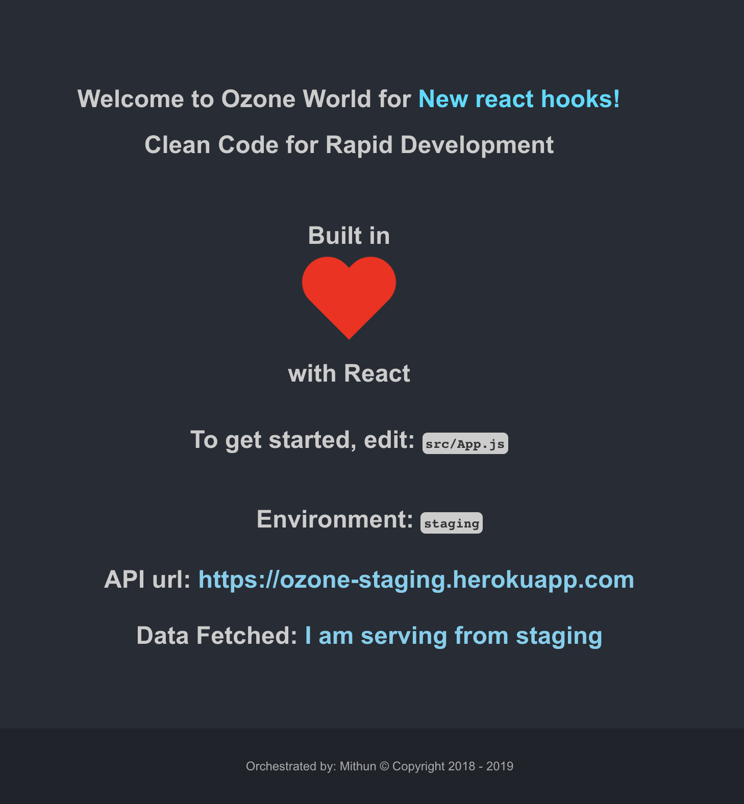

## Preview

## Important Scripts

In the project directory, you can run:

### Run in Development Mode

`npm run start:dev`

API_URL: [http://localhost:4001](http://localhost:4001)
Open [http://localhost:3000](http://localhost:3000) to view it in the browser.

The page will reload if you make edits.

You will also see any lint errors in the console.

### Run Staging

`npm run start:staging`

API_URL: [http://localhost:4001](http://localhost:4001) - update this in `env-config.json`
Open [http://localhost:3002](http://localhost:3002) to view it in the browser.

The page will reload if you make edits.

You will also see any lint errors in the console.

### Run in production

`npm run start:prod`

This runs `npm run build` for optimization and starts the app in the Production mode.

API_URL: [http://localhost:4001](http://localhost:4001) - update this in `env-config.json`
Open [http://localhost:3003](http://localhost:3003) to view it in the browser.

### Run Tests

Note that the development build is not optimized.
Ensure the build works, run `npm run build`.

`npm test` to run the tests.

## About this scaffold

This project was bootstrapped with [Create React App](https://github.com/facebook/create-react-app).
